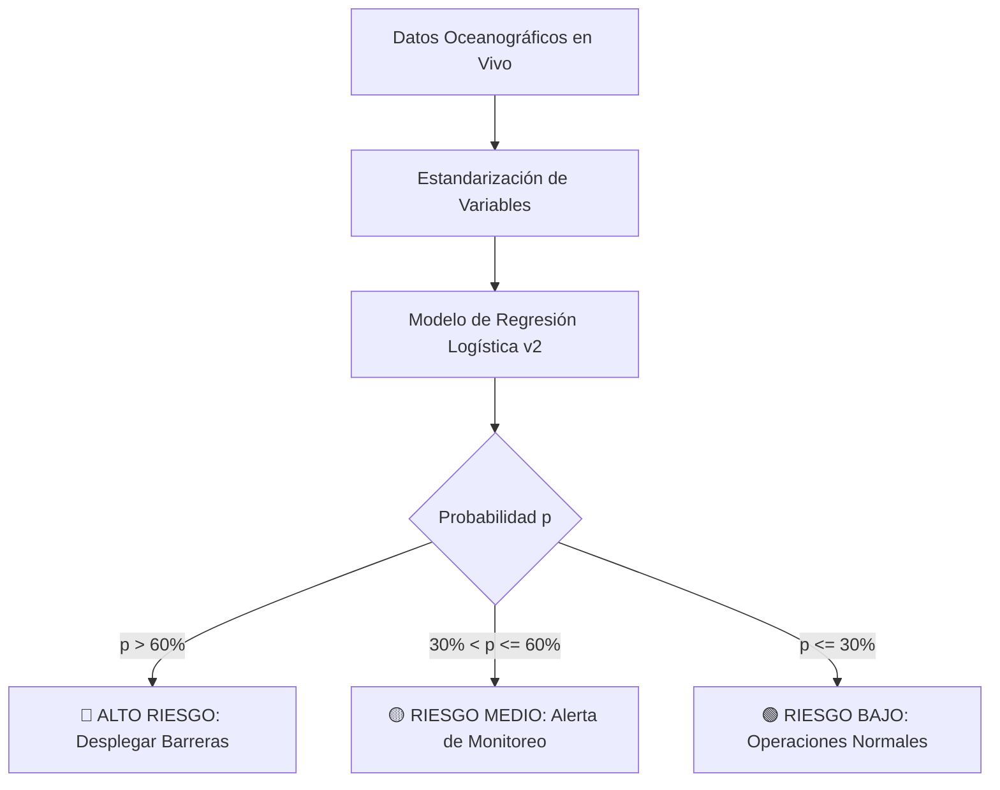
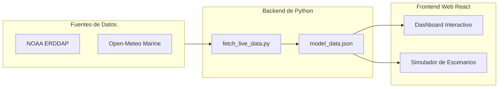

# Proyecto Sargazord: Sistema de Alerta Temprana y Modelado Predictivo de Sargazo en la República Dominicana

## Introducción: La Invasión Dorada y la Necesidad de Actuar

Desde el año 2011, las costas del Mar Caribe han enfrentado un fenómeno sin precedentes: la llegada masiva y recurrente de enormes balsas de sargazo pelágico (*Sargassum fluitans* y *Sargassum natans*). Lo que antes era un componente saludable de los ecosistemas oceánicos se ha convertido en una marea dorada que sofoca los arrecifes de coral, destruye las praderas de pastos marinos y provoca desastres económicos multimillonarios en el sector turístico de la República Dominicana, afectando directamente a destinos clave como Punta Cana, Bávaro, Macao, Uvero Alto y La Romana.

Cuando el sargazo llega a la costa y se descompone, libera gases tóxicos como el sulfuro de hidrógeno ($H_2S$) y el amoníaco ($NH_3$), ahuyentando a los visitantes y creando riesgos de salud pública. 

Ante esta crisis, la pregunta fundamental que inspiró este proyecto fue: **¿Cómo podemos adelantarnos a la llegada del sargazo para que las brigadas de limpieza y los sistemas de barreras flotantes puedan actuar de manera preventiva y no reactiva?**

Para responder a esto, nació **Sargazord**: un ecosistema tecnológico que integra datos satelitales, variables oceanográficas en tiempo real y modelos de aprendizaje automático para predecir el nivel de riesgo de arribazón en las costas dominicanas.

---

## 1. El Modelo de Predicción: Probabilidad de Arribazón

El proyecto comenzó con una hipótesis simple: **El crecimiento y transporte del sargazo están dictados por las condiciones del océano**. 

Para construir una herramienta útil para la toma de decisiones, decidimos predecir la **probabilidad de que ocurra un evento de arribazón (bloom_event)** en la costa dominicana.

### El Modelo: Regresión Logística (Logit)
En lugar de intentar predecir un índice de reflectancia continuo y abstracto (como el NFAI de la V1), decidimos predecir la probabilidad directa de arribazón de sargazo.

Definimos matemáticamente un "evento de arribazón" como aquellos días en los que el porcentaje de cobertura de sargazo en la región de estudio supera el **percentil 80 (P80)** del registro histórico (lo que representa aproximadamente el $20\%$ de los días con mayor volumen de sargazo).

Al transformar el problema de una regresión continua a una **clasificación binaria** ($1 = \text{Arribazón}$, $0 = \text{Día Normal}$), pudimos utilizar un modelo de **Regresión Logística (Logit)**. Esto nos permite entregar al usuario final una **probabilidad de riesgo (de 0% a 100%)**, la cual se traduce de inmediato en un sistema de semáforo de alerta temprana:

### Expansión de Variables y Tratamiento de la Colinealidad
Para robustecer el modelo, exploramos la incorporación de más variables físicas y químicas, controlando estrictamente la colinealidad (variables altamente correlacionadas que confunden al modelo):
*   **Nutrientes:** El Nitrato ($\text{NO}_3$) y el Silicato ($\text{Si}$) mostraron una correlación de $>0.77$ con el Fosfato ($\text{PO}_4$) y el Hierro ($\text{Fe}$) respectively. Para evitar redundancia, los excluimos y conservamos únicamente el **Fosfato ($\text{PO}_4$)** y el **Hierro ($\text{Fe}$)** como indicadores de fertilización.
*   **Física Marina:** Añadimos la **Salinidad** (que influye en la flotabilidad y densidad del agua) y la componente meridional de las corrientes (**$V_o$**, componente norte-sur), completando el vector de transporte junto a la corriente zonal ($U_o$).

El nuevo modelo utiliza 6 variables independientes estandarizadas mediante puntuación $Z$:

$$z = -2.2470 + 0.2751 \cdot \text{sst\_anom}_{\text{scaled}} + 2.3539 \cdot \text{salinidad}_{\text{scaled}} - 1.5732 \cdot \text{po4}_{\text{scaled}} + 0.5788 \cdot \text{fe}_{\text{scaled}} + 1.7560 \cdot \text{uo}_{\text{scaled}} + 0.5574 \cdot \text{vo}_{\text{scaled}}$$

$$\text{Probabilidad de Arribazón} (p) = \frac{1}{1 + e^{-z}}$$

Este nuevo enfoque probabilístico logró un rendimiento sobresaliente, alcanzando un **AUC-ROC de $0.909$** en la fase de validación, lo que demuestra una alta capacidad para discriminar días normales de verdaderos eventos de arribazón masiva.

---

## 3. Decisiones de Diseño Científico y Solución de Errores Críticos

Durante la construcción del pipeline de datos, nos topamos con obstáculos técnicos que requirieron decisiones de diseño clave para la tesis:

### El Error del Flag de Calidad NFAI (Un "Bug" Científico)
Al procesar las imágenes satelitales diarias de CMEMS, notamos que el sargazo parecía "desaparecer" por completo de los DataFrames tras la decodificación. Al investigar a fondo los metadatos de los archivos NetCDF, descubrimos una anomalía en la definición de la máscara de calidad:
El valor asignado por el satélite para una "observación válida de sargazo" era `32767`, pero este valor coincidía exactamente con el `_FillValue` (valor reservado para representar datos nulos o faltantes). Las librerías estándar de Python (`xarray` y `netCDF4`) reemplazaban automáticamente el valor `32767` por un `NaN` al abrir el dataset. 

*   **Solución:** Modificamos el pipeline de carga para abrir los archivos crudos usando `mask_and_scale=False`. Esto deshabilitó la conversión automática de nulos, permitiéndonos recuperar el flag original `32767` y medir correctamente el sargazo sin pérdidas de información.

### Por Qué Normalizar (StandardScaler)
Las variables oceanográficas se miden en escalas completamente diferentes: el hierro se mide en fracciones microscópicas de milimoles ($\sim 0.001$), mientras que la salinidad ronda los $36$ gramos por litro. Si entrenamos una regresión logística con estos valores directamente, el modelo le daría un peso desproporcionado a las variables con magnitudes numéricas grandes (como la salinidad) e ignoraría a las pequeñas (como el hierro), independientemente de su importancia biológica real. 

Estandarizar los datos restándoles su media y dividiéndolos por su desviación estándar asegura que todas las variables jueguen en igualdad de condiciones en el modelo.

---

## 4. Arquitectura y Funcionamiento del Ecosistema Sargazord

El proyecto no es solo un modelo teórico en un Jupyter Notebook; es una plataforma de software integrada que consta de tres capas principales:

### Capa 1: Captura de Datos y Predicción en Vivo (Python)
El script [fetch_live_data.py](file:///c:/Users/josel/Desktop/Sargazo%20Awareness%20Website/Sargazord-main/fetch_live_data.py) actúa como el recolector de datos del sistema. Una vez al mes, realiza peticiones automáticas a las APIs de NOAA (para obtener anomalías térmicas) y a Open-Meteo (para obtener salinidad y velocidad/dirección de corrientes). 

Calcula las componentes zonales y meridionales del viento y corriente, aplica los parámetros de normalización y la fórmula logística, y guarda el nuevo punto en el historial del archivo [model_data.json](file:///c:/Users/josel/Desktop/Sargazo%20Awareness%20Website/src/app/model_data.json).

### Capa 2: Almacenamiento de Datos Centralizado (`model_data.json`)
El archivo JSON actúa como puente (API estática) entre Python y el Frontend. Contiene:
*   Los coeficientes entrenados del modelo.
*   Las estadísticas descriptivas (medias y desviaciones estándar) necesarias para la normalización.
*   Las coordenadas geográficas y valores históricos de referencia para 13 playas dominicanas.
*   El histórico de predicciones mensuales para graficar series de tiempo.

### Capa 3: La Aplicación Web Interactiva (React / Vite)
Desarrollada con una estética oscura premium, la web proporciona al usuario dos pestañas operativas cruciales:
1.  **El Monitor de Riesgo Activo:** Muestra un mapa de la costa este y sureste de la República Dominicana con marcadores en cada playa. Cada marcador se colorea dinámicamente según el nivel de probabilidad de arribazón calculado para esa fecha, permitiendo a las autoridades ver de un vistazo qué zonas están bajo alerta roja, amarilla o verde.
2.  **El Simulador de Escenarios:** Esta es la herramienta de investigación. Permite a los científicos y usuarios manipular 6 deslizadores (sliders) correspondientes a cada variable. Al moverlos, la interfaz normaliza el valor ingresado y calcula al instante en el navegador la nueva probabilidad de arribazón. Esto ayuda a responder preguntas hipotéticas como: *“Si la temperatura del mar sube 0.5°C y el fosfato aumenta por fertilizantes de ríos, ¿cuánto subirá el riesgo de arribazón en playa Macao?”*

---

## Conclusión: El Valor de la Predicción en el Mundo Real

El paso de la **Versión 1** a la **Versión 2** del proyecto Sargazord representa el paso de un modelo puramente teórico a un **sistema de toma de decisiones operativo**. Al cambiar el enfoque de predecir un índice de reflectancia satelital a predecir la probabilidad matemática de una catástrofe de arribazón, el proyecto se convirtió en una herramienta real de alerta temprana. 

La integración de scripts automatizados en Python y una interfaz web interactiva en React demuestra cómo la ciencia de datos aplicada a la oceanografía puede aportar soluciones tangibles para la resiliencia climática y la protección ecológica de las costas de la República Dominicana.
