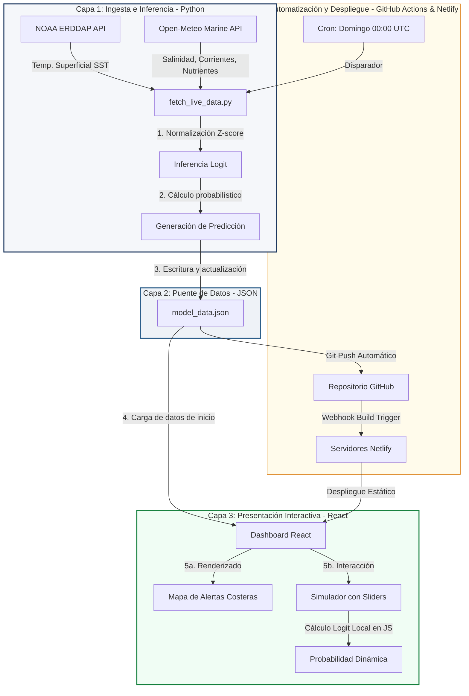

# Pipeline de Arquitectura en 3 Capas: Ecosistema Sargazord

El ecosistema tecnológico **Sargazord** está diseñado bajo una arquitectura desacoplada de 3 capas. Esta topología permite separar las tareas pesadas de ingesta de datos y cálculo científico (realizadas en Python) de la interfaz de usuario interactiva (desarrollada en React/Vite), utilizando un archivo JSON estático como canal de comunicación (Bridge).

A continuación se detalla la estructura del flujo de datos, la lógica operativa de cada capa y el mecanismo de automatización de la plataforma.

---

## 1. Diagrama de Flujo del Pipeline (Dataflow)

El siguiente diagrama ilustra cómo fluyen los datos desde los servidores meteorológicos globales hasta la pantalla del usuario final:

---

## 2. Desglose Operativo de las 3 Capas

### Capa 1: Captura e Inferencia (Motor de Python)
Esta capa es responsable de la recolección, homogeneización y cálculo del modelo. Se ejecuta de forma programada en un entorno de contenedor virtual:
1.  **Ingesta de Datos Climáticos:** El script realiza consultas HTTP asíncronas a las APIs geoespaciales de la NOAA y Open-Meteo. Solicita las medias de los últimos 30 días en las coordenadas de la República Dominicana para las variables: Anomalía de temperatura superficial del mar (SST), salinidad marina, fosfato (PO₄), hierro (Fe) y las corrientes zonales ($U_o$) y meridionales ($V_o$).
2.  **Preprocesamiento y Estandarización:** Al recibir los datos, se calcula el Z-score de cada variable usando la desviación estándar y media histórica guardada para equilibrar las escalas.
3.  **Inferencia del Modelo:** Se aplica la ecuación logística entrenada:
    $$z = -2.2470 + 0.2751 \cdot \text{SST}_{\text{scaled}} + 2.3539 \cdot \text{Salinidad}_{\text{scaled}} - 1.5732 \cdot \text{PO4}_{\text{scaled}} + 0.5788 \cdot \text{Fe}_{\text{scaled}} + 1.7560 \cdot \text{Uo}_{\text{scaled}} + 0.5574 \cdot \text{Vo}_{\text{scaled}}$$
    $$p = \frac{1}{1 + e^{-z}}$$
4.  **Generación de Resultados:** Se asocia la probabilidad resultante al mes en curso y se formatea el resultado en estructura JSON.

### Capa 2: Puente de Datos (`model_data.json`)
Es el núcleo del desacoplamiento (Bridge pattern). En lugar de usar una base de datos activa SQL/NoSQL (que requeriría servidores encendidos 24/7 y costos de mantenimiento), los datos se serializan en un archivo JSON plano y optimizado de apenas ~16 KB:
*   **Contenido:** Almacena los coeficientes fijos del modelo, las estadísticas descriptivas para la normalización en vivo, el registro mensual de los últimos 24 meses y las coordenadas geográficas de las playas.
*   **Ventaja de Rendimiento:** Al ser estático, el navegador lo descarga instantáneamente al cargar la página (aprovechando la caché del cliente) reduciendo el tiempo de carga del sitio a milisegundos.

### Capa 3: Frontend e Interactividad (React / Vite)
Es la capa de presentación y simulación en tiempo real que corre directamente en el navegador del usuario:
1.  **Carga e Ingesta:** Al inicializar la App, se importa el archivo JSON. El dashboard se renderiza de inmediato con los datos climáticos más recientes.
2.  **Visualización en Mapa:** Se posicionan los pines sobre un mapa interactivo (mediante Mapbox o Leaflet) coloreándolos según el riesgo (Verde $\le 30\%$, Amarillo $30\% - 60\%$, Rojo $> 60\%$).
3.  **Simulación Local en el Cliente (Offline):** Cuando el usuario interactúa con los deslizadores del panel simulador:
    *   La aplicación lee los valores directamente de los sliders.
    *   Aplica la estandarización Z-score localmente en JavaScript usando las estadísticas de la Capa 2.
    *   Resuelve la ecuación Logit en tiempo real, permitiendo visualizar los cambios en la probabilidad de arribazón de forma instantánea sin realizar peticiones de red al servidor.

---

## 3. El Flujo de Automatización (Pipeline CI/CD)

Para mantener la información al día de forma automática sin intervención humana ni costes de infraestructura activa, se implementó el siguiente flujo automatizado:

1.  **Cron Scheduler (GitHub Actions):** Cada domingo a las 00:00 UTC, GitHub levanta una máquina virtual liviana basada en Linux.
2.  **Ejecución del Script:** La máquina virtual instala Python, descarga las dependencias (`requests`, `numpy`, etc.) y ejecuta [fetch_live_data.py](file:///c:/Users/josel/Desktop/Sargazo%20Awareness%20Website/Sargazord-main/fetch_live_data.py).
3.  **Commit de Datos:** Tras actualizar `model_data.json`, el flujo de GitHub Actions realiza un commit firmado y hace un push de vuelta a la rama principal (`main`) del repositorio.
4.  **Despliegue Continuo (Netlify):** Netlify, al detectar un nuevo cambio en la rama `main`, activa automáticamente su pipeline de construcción. Compila el código React en archivos estáticos HTML/JS/CSS optimizados y los distribuye a su red de entrega de contenido global (CDN) en menos de 2 minutos.
